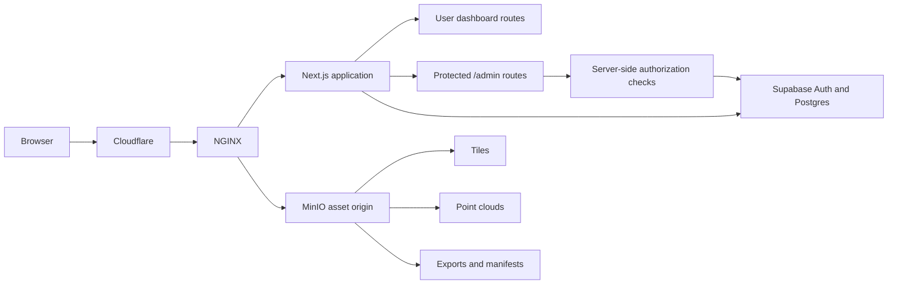

# Admin Dashboard Integration and Production Rollout Plan

Status: Phase 3I-A workshop manifest gate implemented for review
Scope: Current plan plus completed additive foundation. Classification, membership, asset, and destructive mutations still require separate approval.
Reviewed source: `docs/ASIMOV-HAWKS_Web_App_Deployment_Plan_Final.docx` (owner-supplied)

Repository evidence in this document describes checked-in contracts only. It does not prove the current state of any remote staging or production Supabase project.

## 1. Purpose

Integrate the interns' Admin Dashboard into the main ASIMOV-HAWKS application without disrupting existing authentication, survey access, geospatial visualization, or production data. The work must reconcile two independently developed Next.js/Supabase systems, preserve the main Supabase project as the source of truth, and deliver the combined application through the proposed Docker/NGINX/MinIO/Cloudflare architecture for invited users over the public internet during the October 2026 workshop.

This remains a gated plan. Phase 3A established the additive domain foundation, Phase 3B-3D added platform-admin read-only visibility, Phase 3E added classification readiness, Phase 3F enables only audited legacy-client classification-field updates, Phase 3G-A adds audit coverage for canonical client mapping tables, Phase 3G-B maps legacy clients to existing canonical people or organizations, Phase 3G-C creates minimal canonical people/organizations before immediately mapping them to a legacy client, Phase 3H-A adds read-only membership readiness visibility, Phase 3H-B enables platform-admin creation of ordinary member memberships for existing profiles and existing organizations, Phase 3H-C enables platform-admin status changes for ordinary memberships, and Phase 3I-A adds a sanitized workshop manifest gate. Organization-admin promotion, Auth-user creation, farm, grant, asset migration, infrastructure cutover, and destructive workflows still require separate approval.

## 2. Confirmed baseline

### Main application

- Next.js 15 App Router, React 19, TypeScript, Tailwind CSS, and shadcn/Radix UI.
- Supabase provides authentication, relational data, and detected-object storage.
- The compatible application uses `profiles.organization_id` and `surveys.client_id` as UUID tenant keys while legacy code columns remain during the expand phase.
- Database roles and RLS are checked in for `platform_admin`, `org_admin`, `editor`, and `viewer`; additive domain tables and platform-admin Admin Dashboard list/detail pages are implemented. Phase 3F adds a platform-admin-only legacy-client classification-field mutation, Phase 3G adds controlled canonical client mapping, and Phase 3H adds controlled ordinary membership creation and status management.
- Server Components and server actions perform protected reads; MapLibre and Three.js views are dynamically loaded as client-only modules.
- Orthomosaic tiles and PCD point clouds are served from ignored `public/tiles` and `public/3d` directories.
- The repository contains a reconstructed Supabase baseline, UUID tenant migrations, hardened RLS, deferred contract/storage SQL, generated types, verification SQL, and pgTAP authorization tests. There is no general application test suite or CI workflow.
- Lint and type-check baselines currently fail, and the production build reached the Node heap limit during repository assessment.
- `SUPABASE_SERVICE_ROLE_KEY` is restricted to local administrative operations and must not be used by the application or deployment jobs.

### Intern Admin Dashboard

The following are known:

- It was developed as a separate project.
- It uses a different Supabase project.
- Its schema was modified because the interns could not access the main project or production database.

Everything else—including its routes, feature set, dependencies, role model, data assumptions, migrations, policies, test coverage, and deployment readiness—must be inspected rather than assumed.

### Deployment direction

The owner-supplied deployment plan proposes:

- Cloudflare as the public edge and cache.
- NGINX for stable path-based origin routing.
- A stateless Dockerized Next.js application.
- Supabase for authentication, relational metadata, roles, and application data.
- MinIO as S3-compatible storage for tiles, point clouds, exports, and manifests.
- Separate application and asset publication pipelines.
- Prometheus/Grafana metrics and centralized logs, with Loki suggested.
- Incremental scaling; Kubernetes is explicitly deferred.
- Immutable asset versions, checksums, backups, recovery testing, load testing, and rollback gates before production.

The document reports approximately six million files and 200 GB in the current public asset tree. Treat those values as an owner-supplied infrastructure baseline to remeasure before migration.

### Workshop deployment clarification

The September 28-30 release is a limited public-internet production deployment for invited workshop users, not a LAN-only trial. Dockerized Next.js, NGINX, Cloudflare DNS/HTTPS/proxying/basic protection, Supabase, and MinIO or another approved asset origin are therefore workshop-critical scope.

Only an approved manifest of invited clients and their required organizations, accounts, surveys, maps, tiles, point clouds, detections, outputs, and metadata must move before the workshop. Phase 3I-A records the sanitized manifest gate in `docs/workshop-manifest-template.md` and the machine-readable example shape in `docs/workshop-manifest.example.json`. The full historical dataset and all other clients remain deferred. Reliability, organization-based authorization, stable URLs, external-internet testing, backup, and rollback take priority over complete infrastructure automation.

Cloudflare must not turn restricted survey assets into public cache entries. Cache rules and asset URLs must preserve the approved organization and explicit-grant access model. The exact signed URL, signed cookie, authorization gateway, or equivalent protected-delivery mechanism remains a blocking security design decision before workshop asset cutover.

## 3. Recommended target architecture

The default recommendation is to integrate the Admin Dashboard into the existing Next.js application under a protected `/admin` route group, not deploy it as a permanent second frontend.

Reasons:

- Authentication, layouts, types, UI primitives, and Supabase access can be shared.
- One origin avoids duplicated session handling and cross-application authorization drift.
- Admin changes can participate in the same migration, testing, release, and rollback process.
- The main application is still small enough at the route level to support a well-bounded admin domain.

This recommendation must be revisited after the code comparison. A separately deployed admin application is justified only if the interns' implementation has materially incompatible framework/runtime constraints, independent release or isolation requirements, or a security boundary that cannot be cleanly expressed in one application.



### Application boundaries

- `app/dashboard/`: existing farmer/field-personnel experience.
- `app/admin/` or an equivalent protected route group: admin-only pages and layouts.
- `lib/actions/`: server-side use cases, separated by domain; authorization is checked inside every protected operation.
- `lib/authz/`: proposed centralized role and permission evaluation after the schema is approved.
- `components/admin/`: admin-specific components.
- `components/ui/`: shared primitives only; do not place domain behavior here.
- Supabase RLS: authoritative data boundary.
- Server-side checks: defense in depth and clearer application errors.
- Client-side checks: display behavior only, never authorization.

## 4. ASIMOV-HAWKS Farmer and Plantation Domain Model

### Confirmed repository facts

- **Application users and profiles:** Supabase `auth.users` provides login identity. `app_private.handle_new_user()` in `supabase/migrations/20260727002000_harden_uuid_authorization.sql` creates one unassigned `profiles` row with role `viewer`. `profiles.id` is the Auth user ID and the table contains account/contact fields, preferences, one `organization_id`, and one role. It is an application-account record, not a general farmer registry.
- **Historical clients:** `clients` now retains compatibility fields plus additive classification fields in `lib/database.types.ts`. `lib/auth/user-context.ts` and `lib/actions/clients.ts` still treat `profiles.organization_id` and `surveys.client_id` as the operating tenant boundary. Confirmed product knowledge says legacy clients are mixed and may represent cooperatives, associations, organizations, or individuals.
- **Membership and access:** the current relationship is one profile to at most one client through `profiles.organization_id`. No person-to-organization or profile-to-multiple-organizations junction exists. RLS and server checks support `platform_admin`, `org_admin`, `editor`, and `viewer` for that single-organization model.
- **Farmers, contacts, and stakeholders:** Phase 3A added `people`, `client_people`, `organization_people`, and `farm_people`, but existing records are not yet classified or populated by an approved workflow. A person can be represented without a login once reviewed data entry is approved.
- **Farms and plantation areas:** Phase 3A added `farms`, `farm_people`, `farm_organizations`, and `survey_farms`. Existing survey routes still resolve through compatible clients and survey records; no current user workflow depends on `survey_farms` yet. Despite its name, `app/dashboard/orthomap/[plantation]/page.tsx` resolves `[plantation]` through `clients.code`; this remains a tenant route, not proof of a farm entity.
- **Missions and surveys:** `surveys` is the current combined mission/survey record. It stores status, flight date, area, location, boundaries, `client_id`, and legacy code relationships. `getUserSurvey()` and `getAllUserSurveys()` in `lib/actions/surveys.ts` authorize directly through `client_id`.
- **Outputs and reports:** `orthos.survey_id` and `point_clouds.survey_id` trace those specialized outputs to surveys. Tile paths derive from client code, year, survey ID, and `orthos.tile_folder`. Detected objects are stored as organization-level JSON and filtered by `areaCode`. Generic model outputs, analytics, disease/crop outputs, and reports have no relational catalog.
- **Storage:** `getObjectDetectionData()` reads `<client-uuid>/detections.json` with a temporary `<client-code>.json` fallback. `supabase/deferred/secure_detected_objects_storage.sql` authorizes the UUID path by organization only.
- **Admin and audit:** Phase 3A added `admin_audit_log`; Phase 3B-3D added platform-admin read-only Admin Dashboard overview, lists, and detail pages under `app/dashboard/admin`; Phase 3F adds a server-side legacy-client classification-field update path. Phase 3G-A adds dedicated composite-key audit coverage for `client_people` and `client_organizations`; Phase 3G-B adds checked RPCs and platform-admin UI for confirming mappings to existing canonical records. Phase 3G-C adds checked create-and-map RPCs and UI for minimal canonical people and organizations. Phase 3H-A adds read-only organization membership review views with profile and organization context. Phase 3H-B adds a narrow platform-admin form for creating ordinary `member` memberships for existing profiles and existing organizations. Phase 3H-C adds platform-admin status changes for ordinary memberships only: approve pending members, suspend active members, reactivate suspended members, or mark live memberships removed without deleting records.

### Answers to the domain questions

1. Profiles and Auth users are modeled together; `clients` is the mixed historical tenant boundary; surveys are the current mission records; only orthos and point clouds are relational output records.
2. There is no separate farmer/contact/stakeholder model.
3. There is no separate farm or plantation-area model.
4. The organization model has no organization type.
5. Individual farmers cannot yet be represented as domain people without either creating a login profile or misusing `clients`; neither workaround is acceptable.
6. Cooperatives and associations cannot yet have modeled farmer members or contacts.
7. The current profile model is single-organization only.
8. Surveys can be viewed under the current client tenant, but not under separately identified people, organizations, or multiple farms.
9. Orthos and point clouds trace to surveys, but survey-to-farm traceability and generic output/report traceability are missing.

### Minimum safe domain extension

Keep `clients` unchanged as the historical compatibility tenant. Additive migrations should eventually introduce:

- `people`: farmers, owners, members, representatives, and contacts who may have no login.
- `organizations`: canonical typed organizations, including cooperative, association, farmer organization, federation, plantation/company, government agency, academic institution, NGO, private partner, and other.
- `client_people` and `client_organizations`: separately constrained, reviewed mappings from mixed clients to canonical people or organizations; unresolved clients remain `unclassified`.
- Nullable `profiles.person_id`: an optional account-to-person link. Existing cooperative or organization-level accounts may remain unlinked.
- Global account role `platform_admin` or `individual`, separate from organization membership role `org_admin` or `member` and membership status `invited`, `pending`, `active`, `removed`, or `suspended`.
- `organization_memberships`: profile-based access membership with at most one live organization per normal account in the first release.
- `organization_people`: non-authorizing domain relationships for farmer-members, representatives, and contacts who may have no login.
- `farms`, `farm_people`, and `farm_organizations`: monitored areas and owner/operator/representative/contact metadata that does not grant access automatically.
- `survey_farms`: many-to-many survey/farm relationships with relationship type, covered area, notes, and at most one primary farm per survey.
- `survey_organizations`: the requesting or participating organization independently of legacy `surveys.client_id`.
- `farm_access_grants` and `survey_access_grants`: explicit exceptions; a farm grant does not reveal a shared survey or its outputs.
- `survey_outputs`: records for output categories lacking relational metadata, while preserving `orthos` and `point_clouds`.
- Append-only audit records for security-sensitive administration.

Target relationship summary:

```text
auth.users 1--1 profiles 0--1 people
clients --> people/organizations through reviewed legacy mappings
profiles 0--1 active organization through organization_memberships
people/organizations M--N farms through domain relationships
surveys M--N farms through survey_farms
surveys M--N organizations through survey_organizations
surveys 1--M orthos, point_clouds, and survey_outputs
```

### Implement now versus defer

The first domain release has established the additive tables, RLS foundation, generated types, read-only readiness, controlled legacy-client classification, canonical person/organization mapping writes, ordinary membership creation, and ordinary membership status updates with audit coverage. The next release slice should stay narrow and focus on the next approved access or dataset workflow rather than broad admin expansion. Defer general multi-organization user access, Auth-user creation, custom organization-type administration, a separate mission-planning table, advanced DAM/publication, crop taxonomy, destructive deletion, full-history asset migration, complete infrastructure automation, and legacy-column removal.

### Admin information architecture

The practical first-release navigation remains Organizations, Farmers & Contacts, Farms & Plantation Areas, Missions & Surveys, Outputs & Reports, Users & Roles, and Audit Log. Current implementation exposes platform-admin list/detail visibility for the first six domain areas, plus controlled legacy-client classification, canonical mapping, and ordinary membership workflows. Audit Log UI and broader mutations remain gated. Organization lists must display type; people views must distinguish farmer/contact identity from login status; farm details must show reviewed owners/operators and related surveys; survey details must show farm and organization context plus generated outputs. Do not label every farmer as an organization, every cooperative as a user, every farm as a survey, or outputs as directly organization-owned when they derive from a survey.

### MVP and delivery milestones

The MVP includes a protected admin route, legacy-client and organization visibility/classification, member management, user/profile visibility, farm and survey visibility, maps/output visibility, compatible basic statistics, and an audit foundation for implemented mutations. Every intern feature must first be classified as adopt, adapt, rebuild, or drop against a pinned commit.

Defer Auth-user creation, full DAM, full-history MinIO migration, complete Cloudflare/NGINX automation, advanced analytics, bulk import/export, destructive delete workflows, complex publication, full asset management, and multi-organization user access. The minimum Docker/NGINX/Cloudflare and protected asset-origin path needed for invited workshop users is included in the MVP.

- Production deployment target: September 28-30, 2026.
- Stabilization, documentation, and handoff: October 1-9, 2026.
- Final completion deadline: October 9, 2026.
- Rollout order: internal/platform administrators, then one known cooperative or organization, then the approved invited workshop cohort after acceptance.
- Rollback authority: technical owner/project lead.

Deadline protection requires scope reduction before security, backward compatibility, RLS verification, audit coverage, or recovery rehearsal is reduced.

### Risks, assumptions, and approval gates

- **Approved fact:** existing `clients` are mixed historical tenants and surveys may span multiple farms. Do not force them into a single canonical entity type or farm foreign key.
- **Approved access rule:** normal users have at most one live organization membership in v1. Farm domain relationships do not grant access; shared surveys require explicit survey grants.
- **Approved privilege rule:** only platform admins may promote organization admins. Organization admins manage ordinary membership only inside their organization.
- **Confirmed risk:** applying `supabase/deferred/contract_uuid_tenant_keys.sql` now would encode the old single-client authorization model before canonical mappings and grants exist.
- **Confirmed risk:** organization-level detection JSON contains multiple survey areas, and local `public/tiles`/`public/3d` assets are not protected by database RLS. Do not promise narrow asset isolation through a farm or survey grant until protected delivery is approved.
- **Human approval required:** Auth-user provisioning, output/report publication and retention, audit retention, invitation delivery, and protected survey-scoped asset delivery.

No Admin Dashboard business mutation, domain migration, deferred contract operation, or storage finalization may proceed until the blocking classifications and access decisions are approved.

## 5. Authorization design gate

The first-release authorization direction is approved:

1. Global account roles are `platform_admin` and `individual`.
2. Organization membership roles are `org_admin` and `member`.
3. Normal accounts have at most one live organization membership.
4. Organization admins may invite, approve, suspend, and remove ordinary members only in their organization.
5. Only platform admins may promote or manage organization admins, classify legacy clients, or issue exceptional access grants.
6. Farm owner/operator/representative/contact metadata never grants application access automatically.
7. A farm grant exposes the farm record only; a separate survey grant is required for shared survey data and outputs.

### Recommended model to evaluate

Do not overload legacy profile fields or `profiles.organization_id` with all future authorization behavior. Evaluate the approved domain model containing:

- Application profiles linked optionally to separate people/contact records.
- Canonical typed organizations separate from mixed historical `clients`.
- Person-to-organization memberships separated from profile authorization.
- Profile organization membership for `org_admin` or `member`, with one live membership per normal account.
- Global `platform_admin` or `individual` account state, while current viewer/editor fields remain temporarily for compatibility.
- Farms visible through active organization membership or explicit farm grants, never ownership metadata alone.
- Surveys and outputs visible through connected organization membership, explicit survey grants, or the temporary legacy client path.
- Permission rules expressed primarily through RLS.
- Optional application-level permission helpers for consistent server-side checks.
- Audit records for security-sensitive admin mutations.

The exact SQL remains blocked until legacy records and the unresolved human decisions in this plan are approved.

### Service-role constraint

Supabase Auth administrative APIs normally require privileged server credentials. Because the service-role key is prohibited in application runtime and deployment jobs, the Admin Dashboard must not silently assume it can create, delete, ban, or directly administer Auth users.

Choose and approve one user-lifecycle design:

- Self-signup/invitation followed by an RLS-protected membership approval workflow that does not require runtime service-role access.
- A narrowly controlled privileged backend or Supabase Edge Function with separately approved secret management, which would change the current service-role policy.
- Keep Auth-user provisioning as an external local administrative process and limit the dashboard to membership, role, and application-data administration.

Until this decision is made, user provisioning is out of implementation scope.

## 6. Required discovery inputs

Obtain these artifacts before making reuse or migration decisions:

### Intern codebase

- Repository URL or local path and intended comparison branch/commit.
- README and development commands.
- Package manifest and lockfile.
- Environment-variable names only.
- Routes, layouts, middleware, server actions, API routes, and Supabase clients.
- Admin screens and a feature inventory.
- Shared components, state management, form validation, and styling.
- Domain types and generated Supabase types.
- Tests, CI, deployment configuration, and known issues.
- Any Digital Asset Management implementation or asset-publication workflow.

### Intern Supabase project

- Read-only schema export.
- Tables, columns, types, constraints, indexes, relationships, and seed/reference data.
- RLS enablement and every policy.
- Functions/RPCs, triggers, views, grants, and extensions.
- Storage buckets and bucket policies.
- Auth configuration, custom claims/hooks, role metadata, and email templates.
- Migrations, if any, or a schema history.
- Sanitized representative data for transformation testing.

### Main Supabase project

- The same read-only inventory as the intern project.
- Current data volumes and high-level distribution.
- A confirmed non-production project for migration rehearsals.
- Current backup/export capability and restore validation.

Use a Supabase CLI connection for inspection only after the owner confirms the exact project references. Never link, reset, push, pull destructive changes, or expose credentials during discovery.

## 7. Codebase comparison method

Create a comparison report before copying code. For every admin feature, classify the implementation as:

- **Adopt:** reusable with trivial import/path changes.
- **Adapt:** useful behavior or UI, but data access, types, authorization, or styling must change.
- **Rebuild:** requirements are valid, but the implementation conflicts with the main architecture or security boundary.
- **Drop:** duplicate, obsolete, insecure, or outside approved scope.

Compare at least:

| Area | Questions | Output |
|---|---|---|
| Framework/runtime | Same Next.js/React versions and App Router conventions? | Compatibility decision |
| Routes/layouts | Can routes fit under `/admin` without collisions? | Route map |
| Authentication | How are sessions and redirects handled? | Auth flow comparison |
| Authorization | Where are roles enforced: UI, server, RLS, claims? | Security gap list |
| Data access | Browser queries, server actions, API routes, or RPCs? | Target data-access map |
| Schema assumptions | Which tables/columns/relationships does each feature require? | Feature-to-schema matrix |
| UI system | Tailwind/shadcn compatibility and reusable primitives? | Component reuse list |
| State/forms | State stores, React Hook Form, Zod, caching? | Adaptation list |
| Dependencies | New packages, licenses, duplication, browser cost? | Dependency decision record |
| Tests | What behavior is covered and portable? | Test reuse/gap report |
| Assets/DAM | Does it complement MinIO publication or try to replace storage? | Asset architecture decision |

Do not merge repositories wholesale. Port one approved vertical slice at a time with reviewed imports, types, data access, and tests.

## 8. Database comparison and migration strategy

The main Supabase project remains canonical. The intern schema is a design input and potential data source, not a replacement.

### Step 1: Produce a schema-difference matrix

For every object in both projects, record:

- Object name and purpose.
- Main-project equivalent, if any.
- Column/type/nullability/default differences.
- Primary/foreign keys and delete/update behavior.
- Indexes and uniqueness rules.
- RLS state and policy differences.
- Functions, triggers, views, grants, and storage dependencies.
- Admin features that depend on the object.
- Recommended disposition: keep main, extend main, create new, transform data, or discard.

### Step 2: Define the canonical target schema

- Preserve existing main-project identifiers and relationships whenever possible.
- Add admin-specific structures through forward-only, reviewable migrations.
- Use an expand-and-contract approach: add compatible structures first, migrate/backfill, switch reads/writes, validate, and remove obsolete structures only in a later approved release.
- Avoid renaming or repurposing existing columns during the first admin release.
- Add indexes based on expected admin queries and measured data volumes.
- Generate typed Supabase definitions after the schema workflow is established.

### Step 3: Classify intern data

Separate:

- Reference/configuration data safe to recreate.
- Admin-specific records requiring transformation.
- Duplicates of main production records that must not be imported.
- Auth users that require a dedicated identity-mapping process.
- Test/demo data that must be discarded.
- Asset metadata that must be reconciled with the MinIO target model.

Do not copy `auth.users`, password material, or opaque identity IDs between Supabase projects. Define an approved account invitation/mapping procedure.

### Step 4: Build idempotent transformations

- Use stable source-to-target mapping keys.
- Record migration batches and outcomes.
- Validate row counts, relationships, required fields, and checksums where relevant.
- Make reruns safe.
- Log rejected records without sensitive payloads.
- Keep source exports immutable for audit and rollback.

### Step 5: Rehearse

Run the complete schema and data migration against an isolated non-production clone:

1. Restore or seed representative main data.
2. Apply forward migrations.
3. Import a sanitized intern dataset.
4. Run integrity and RLS tests.
5. Exercise application/admin flows.
6. Measure duration and resource use.
7. Execute and time the approved recovery procedure.
8. Repeat until results are deterministic.

No production migration may occur until backup, rollback/recovery, and ownership procedures are documented and successfully rehearsed.

## 9. Delivery phases and gates

### Branch, commit, and push strategy

`main` is the production branch and receives only reviewed release or hotfix merges. `development` is the integration branch deployed to staging. Every implementation branch starts from an up-to-date `development` and returns through review; do not develop directly on `main`.

| Work | Branch | Target window | Commit and push gate |
|---|---|---|---|
| Final domain/runbook documentation | `development` | July 28-31 | Commit this reviewed documentation gate and push directly as the agreed baseline |
| Intern audit and legacy mapping design | `phase/domain-discovery` | August 3-7 | Commit evidence and decisions separately; push after references and classifications are reviewable |
| Migration/test foundation | `phase/domain-schema` | August 10-14 | Commit additive schema and verification artifacts together; push only after local reset/lint/tests pass |
| Authorization and RLS | `phase/domain-rls` | August 17-21 | Keep policy/helper changes separate from schema; push after the complete local role matrix passes |
| Protected admin shell and overview | `feature/admin-shell` | August 24-28 | Commit route protection before read-only UI; push after auth and responsive smoke tests pass |
| Client/organization classification | `feature/admin-organizations` | August 31-September 4 | Commit one read-only or mutation slice at a time; push after RLS and audit checks pass |
| Membership workflow | `feature/admin-memberships` | September 7-11 | Separate invitation/status logic from UI; push after transition, escalation, and cross-org denial tests pass |
| Farms, surveys, and outputs visibility | `feature/admin-surveys-outputs` | September 14-18 | Commit compatibility data access before UI; push after legacy map/output parity tests pass |
| Workshop container and edge delivery | `feature/workshop-infrastructure` | August 24-September 18 | Commit Docker/NGINX, Cloudflare-origin, and operational-runbook slices separately; push after local/staging health, routing, TLS, and access tests pass |
| Workshop manifest gate | `feature/workshop-manifest-gate` | August 3-7 | Commit sanitized manifest template and approval checklist only; do not commit populated private rosters, assets, or migration outputs |
| Selected workshop asset migration | `feature/workshop-assets` | September 7-18 | Commit migration tooling separately from data; push only after approved manifest, dry-run, checksum, stable-URL, authorization, and rollback checks pass |
| Staging release candidate | `release/admin-mvp-2026-09` | September 21-25 | Merge only accepted MVP branches; allow fixes and documentation only after the release candidate is cut |
| Production promotion | merge release branch to `main` | September 28-30 | Merge and tag only after staging sign-off, backup/recovery confirmation, and rollback approval |
| Stabilization and handoff | `hotfix/<issue>` from `main`, merged back to `development` | October 1-9 | Use one focused hotfix commit per production issue; push after targeted regression checks |

Use concise conventional commits. Each commit must represent one independently reviewable behavior or document change; do not combine schema, RLS, UI, and unrelated cleanup. Push a phase branch after its relevant local checks pass and at each review checkpoint, then open or update its pull request to `development`. Never push known authorization or migration failures to `development` or `main`. Tag the accepted production release `admin-mvp-2026.09.0` and merge every production hotfix back into `development` immediately after release.

### Phase 0: Intake and evidence capture

Actions:

- Freeze and identify the exact intern repository commit and schema snapshot.
- Inventory intern features and stakeholders.
- Connect read-only to both Supabase projects.
- Record current main application, database, storage, and asset baselines.
- Confirm the deployment-plan assumptions, including actual file count, bytes, traffic, hardware, and target regions.
- Record the invited workshop users, approved organizations, and selected dataset manifest using the Phase 3I-A template; keep populated private rosters and sensitive operational values outside Git.
- Confirm external DNS, origin hosting, Cloudflare account ownership, public URL, and workshop test locations.

Deliverables:

- Evidence package.
- Feature inventory.
- Open-question register.

Exit gate:

- Both codebases and schemas are available and reproducibly identified.

### Phase 1: Comparison and scope selection

Actions:

- Complete code and schema matrices.
- Demonstrate each intern admin feature.
- Classify features as adopt/adapt/rebuild/drop.
- Define the minimum production-worthy Admin Dashboard release.
- Include only the minimum workshop internet-delivery infrastructure; explicitly defer nonessential DAM, analytics, full-history migration, and broad automation.

Deliverables:

- Reuse assessment with file/symbol references.
- Approved MVP scope and deferred backlog.
- Initial risk register.

Exit gate:

- Product owner, technical owner, and database owner approve scope.

### Phase 2: Architecture and security design

Actions:

- Decide integrated `/admin` versus separately deployed admin application.
- Classify whether each legacy `clients` record is an organization, plantation area, or unresolved historical tenant.
- Record the approved mixed-client bridge, separate canonical people/organizations, single-organization membership, multi-farm survey, and explicit-grant semantics.
- Keep Auth provisioning, output/report lifecycle, audit retention, and invitation delivery as explicit deferred gates.
- Approve the protected workshop asset-delivery mechanism before implementation or migration.
- Produce a page/permission/data matrix.
- Decide Auth-user provisioning under the service-role restriction.
- Define audit requirements.
- Write architecture decision records for routing, authorization, data access, and asset administration.

Deliverables:

- Target architecture.
- Authorization matrix.
- RLS design.
- Threat model.
- ADRs.

Exit gate:

- Domain and security decisions are approved before schema or UI implementation; unresolved records have an explicit `unclassified`/review path rather than an invented mapping.

### Phase 3: Engineering and operations foundation

Actions:

- Establish a non-production Supabase environment.
- Define migration, backup, restore, and rollback procedures.
- Introduce a checked-in Supabase migration workflow.
- Generate database types.
- Repair lint configuration and agree how to reduce the existing TypeScript baseline.
- Add test tooling and CI gates.
- Containerize Next.js without geospatial datasets.
- Create health/readiness checks and environment validation.
- Establish the NGINX route contract and Cloudflare origin/TLS requirements for the workshop public URL.

Deliverables:

- Reproducible local/staging setup.
- Working validation pipeline.
- Small repeatable application image.
- Tested backup and recovery runbook.

Exit gate:

- Lint, agreed type-check baseline, tests, and container build run in CI.
- Restore and rollback have been demonstrated outside production.

### Phase 4: Authorization and schema foundation

Actions:

- Preserve the applied additive organization/people mapping, single-organization membership, farm, `survey_farms`, `survey_organizations`, explicit grant, output/report, and audit foundation while future write workflows are reviewed in non-production.
- Preserve current UUID tenant columns, legacy code relationships, routes, and asset paths throughout the expand phase.
- Implement and test RLS policies.
- Add centralized server-side authorization helpers.
- Add fail-closed `/admin` layout protection.
- Test anonymous, legacy viewer/editor compatibility, individual, organization member, organization admin, platform admin, explicit farm grant, explicit survey grant, cross-organization, suspended/removed member, and stale-session cases.

Deliverables:

- Approved migrations and policies.
- Authorization test suite.
- Admin route shell with no business mutations.

Exit gate:

- Cross-tenant and unauthorized farm denial, direct-call, audit, and privilege-escalation tests pass without breaking current survey/output workflows.

### Phase 5: Vertical-slice feature integration

Integrate one feature at a time:

1. Read-only admin overview.
2. Organization/member visibility.
3. Role or membership management, if approved.
4. Survey/client administration.
5. Asset catalog/publication controls.
6. Remaining approved intern features.

For each slice:

- Port only classified reusable code.
- Replace intern Supabase assumptions with canonical types and server actions.
- Add RLS and server authorization tests.
- Add loading, empty, error, success, and audit behavior.
- Validate responsive and accessible interaction.
- Release behind a server-enforced feature flag in staging.

Exit gate:

- Each slice independently meets acceptance criteria before the next begins.

### Phase 6: Workshop asset and public-internet delivery

Actions:

- Deploy MinIO or another approved asset origin with backup, recovery, least-privilege access, and enough resilience for the selected workshop datasets.
- Establish immutable object naming for tiles, point clouds, exports, and manifests.
- Store asset identifiers/active versions in Supabase rather than local filesystem paths.
- Configure NGINX to preserve stable asset URLs.
- Configure Cloudflare DNS, HTTPS, proxying, basic protection, safe cache rules, origin protection, invalidation, and the approved signed/restricted delivery mechanism.
- Decide whether the interns' DAM complements catalog/approval/publication; do not allow it to replace MinIO without proving S3 compatibility, integrity, lifecycle, concurrency, and recovery.
- Create an approved workshop manifest from `docs/workshop-manifest-template.md` covering only invited clients and required surveys, maps, tiles, point clouds, detections, outputs, and metadata.
- Migrate only manifest-listed datasets in validated batches while retaining the current source and full historical dataset.
- Test application and protected asset delivery from external internet connections before the workshop.

Deliverables:

- Dedicated asset origin.
- Asset manifest/publication workflow.
- Batch migration reports and rollback paths.
- Stable public application and asset URLs with recorded Cloudflare/NGINX configuration and ownership.

Exit gate:

- Manifest checksums/file counts match, organization and explicit-grant access controls pass, cache behavior is predictable, external internet tests pass, and the workshop application no longer depends on container-local copies of the selected production assets.

### Phase 7: CI/CD and observability

Application pipeline:

1. Install locked dependencies.
2. Lint, type-check, test, and scan.
3. Build the dataset-free Docker image.
4. Tag with immutable commit/version metadata.
5. Push to the approved registry.
6. Deploy to staging.
7. Run health, auth, RLS, route, and asset smoke tests.
8. Require approval for production.
9. Deploy with a reversible strategy.
10. Run post-deploy checks and roll back on failed acceptance criteria.

Asset pipeline:

1. Upload to a staging prefix/bucket.
2. Validate paths, metadata, counts, sizes, and checksums.
3. Publish an immutable version.
4. Update the active dataset record transactionally.
5. Warm/invalidate cache as required.
6. Retain the previous version for rollback.

Observability:

- Application, NGINX, MinIO, Cloudflare, deployment, and Supabase-relevant events.
- CPU, memory, disk capacity/latency, network, request rate, errors, latency percentiles, cache hit ratio, object-store latency, and container health.
- Admin security events and mutation audit records.
- Alerts with named owners and response runbooks.

Exit gate:

- Staging deployment and rollback are repeatable, monitored, and documented.

### Phase 8: Production-readiness validation

Functional:

- Every approved admin feature and permission path.
- Existing dashboard, survey, orthomap, detection, and point-cloud regression.

Security:

- RLS policy tests and cross-tenant attempts.
- Direct server-action/API calls without UI.
- Role escalation, revoked access, session refresh, and feature-flag bypass attempts.
- Secrets, headers, rate limits, upload constraints, and audit integrity.

Performance and accessibility:

- Representative phones, tablets/iPads, laptops, and desktops.
- Touch and keyboard navigation, focus, labels, contrast, zoom, and error announcements.
- Constrained networks and low-memory/GPU devices.
- Admin tables and queries at production-like data volumes.
- Tile and point-cloud payloads, cache behavior, and concurrent usage.
- The deployment plan's initial approximately 1,000-concurrent-user target must be treated as a hypothesis until load tests establish safe limits.
- External tests through the public hostname from networks outside the origin environment, including mobile data or another independent ISP.
- Anonymous, expired-session, removed-member, and cross-organization attempts against application routes and every selected asset class.

Reliability:

- Database restore.
- Object restore.
- Previous-image deployment.
- Previous asset-version activation.
- Cache rebuild/invalidation.
- MinIO disk-failure scenario appropriate to the selected topology.

Exit gate:

- Signed production-readiness report with no unresolved critical/high findings.

### Phase 9: Controlled rollout

1. Deploy code and additive schema with Admin Dashboard disabled.
2. Run production smoke checks against non-mutating paths.
3. Enable read-only access for internal administrators.
4. Observe errors, latency, audit events, and support feedback.
5. Enable approved mutations for a small administrator cohort.
6. Pilot through the public internet with one approved organization.
7. Enable only the approved invited workshop cohort and manifest-listed datasets after the pilot observation window.
8. Keep old asset routes/data and the previous application image available through the rollback window.
9. Remove compatibility paths only in a later approved cleanup release.

Rollback triggers must include authorization leakage, data-integrity failures, elevated error rate, unacceptable latency/memory, failed asset access, or missing audit records.

### Phase 10: Post-production hardening

- Review incidents, audit events, query plans, storage use, cache efficiency, and support feedback.
- Close temporary compatibility paths and feature flags only after stability is demonstrated.
- Reconcile documentation with the deployed state.
- Schedule restore drills, policy reviews, dependency updates, and access reviews.
- Reassess multi-container scaling when measured load requires it.
- Reassess Kubernetes only when service count, scaling pressure, and operations staffing justify it.

## 10. Acceptance criteria for the first production release

- Admin routes fail closed for unauthorized and unauthenticated users.
- Platform-admin, individual, organization-admin, and organization-member permissions match the approved matrix at UI, server, and RLS layers while legacy viewer/editor behavior remains compatible during expansion.
- No cross-organization record is readable or mutable without explicit policy.
- Individual farmers, contacts, organizations, farms, surveys, outputs, and user accounts remain distinguishable in schema and UI.
- Approved organization membership and explicit farm/survey grant paths pass direct RLS tests without fabricated personal organizations or ownership-based access.
- Existing farmer/field workflows regress neither functionally nor in performance.
- All admin mutations are validated, attributable, and audited.
- No service-role credential is present in browser/runtime/deployment configuration.
- Schema changes are forward migrations with a rehearsed recovery procedure.
- Intern data migration is idempotent, validated, and excludes demo/duplicate/Auth credential data.
- Application and asset deployments are independent and reversible.
- Production Docker images exclude tiles and point clouds.
- Asset versions are immutable, verified, and recoverable.
- Required CI checks and production smoke tests pass.
- Mobile/tablet/desktop accessibility and performance targets pass agreed thresholds.
- Monitoring, alerts, ownership, backup, restore, and rollback runbooks are operational.
- The public workshop hostname passes external DNS, HTTPS, NGINX routing, authentication, organization authorization, protected-asset, cache, and rollback tests.
- Every migrated workshop asset and metadata record appears in the approved manifest and passes file-count, byte-count, checksum, relational, and access-scope verification.
- Non-invited clients and the full historical dataset remain outside the workshop migration without breaking their retained source records.

## 11. Key risks

| Risk | Control |
|---|---|
| Farmers, organizations, farms, and surveys are conflated | Separate domain records; human-reviewed legacy classification before backfill |
| Legacy UUID contract conflicts with mixed clients and explicit grants | Keep expand columns and legacy policy paths; replace the deferred contract only after reviewed mappings and new RLS pass |
| Deadline pressure expands scope or weakens verification | Freeze the workshop manifest, defer full-history migration and broad automation, and reduce features before reducing security/recovery gates |
| Intern schema overwrites canonical relationships | Main schema remains authoritative; additive mapping and staged migration |
| UI-only authorization | RLS plus server checks plus direct-call tests |
| Undefined role semantics | Approval gate before schema and UI work |
| Runtime user administration conflicts with service-role policy | Decide user lifecycle explicitly; keep provisioning out of scope until approved |
| Existing validation failures hide regressions | Establish lint/type/test baseline before feature integration |
| Large assets break builds/releases | Dataset-free image, MinIO origin, independent asset pipeline |
| Database migration lacks recovery | Define, rehearse, and time backup/restore/rollback before production |
| Duplicate or mismatched intern data | Data classification, stable mappings, idempotent transformations, reconciliation |
| Cache serves stale/wrong datasets | Immutable versions and controlled active-version switch |
| Low-end devices fail on maps/point clouds | Representative-device tests, payload budgets, progressive/fallback behavior |
| Infrastructure exceeds team capacity | Phase mature components; defer Kubernetes |
| Restricted assets become publicly cacheable | Approve protected delivery, separate cache policies by asset class, and test anonymous/cross-organization requests through Cloudflare |
| Workshop depends on untested local-network assumptions | Test the production hostname, authentication, maps, assets, latency, and rollback from independent internet connections before invitations are issued |

## 12. Decisions still required

1. Auth-user invitation/provisioning approach under the local-only service-role policy.
2. Output/report approval, publication, retention, and audit-retention requirements.
3. Invitation delivery mechanics and whether public self-signup remains enabled.
4. Protected delivery for survey-scoped detections and currently public tile/point-cloud assets.
5. Exact invited-user/organization list and selected workshop dataset manifest.
6. Asset-origin hosting, capacity, backup location, operational owner, and approved public hostname.

## 13. Immediate next step

Proceed with Phase 3I-A review: confirm the workshop manifest template captures invited accounts, organizations, legacy clients, surveys, farms, assets, outputs, authorization tests, external-internet checks, and rollback fields without requiring secrets or unnecessary personal data in Git. After approval, populate the real manifest in the agreed secure location and separately approve protected asset delivery before Docker, NGINX, Cloudflare, or selected asset-origin work begins. No asset migration or infrastructure cutover occurs without separate approval. Work backward from the September 28-30 public deployment window and preserve October 1-9 for stabilization, documentation, workshop support, and handoff.
